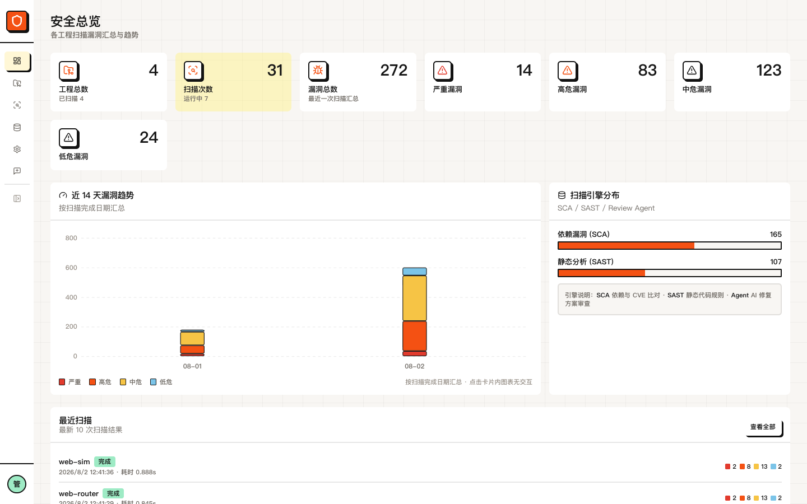
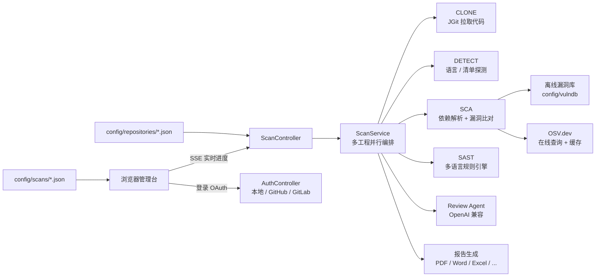
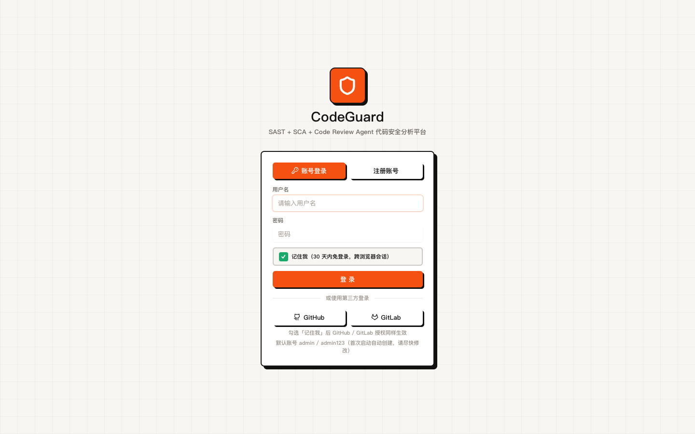
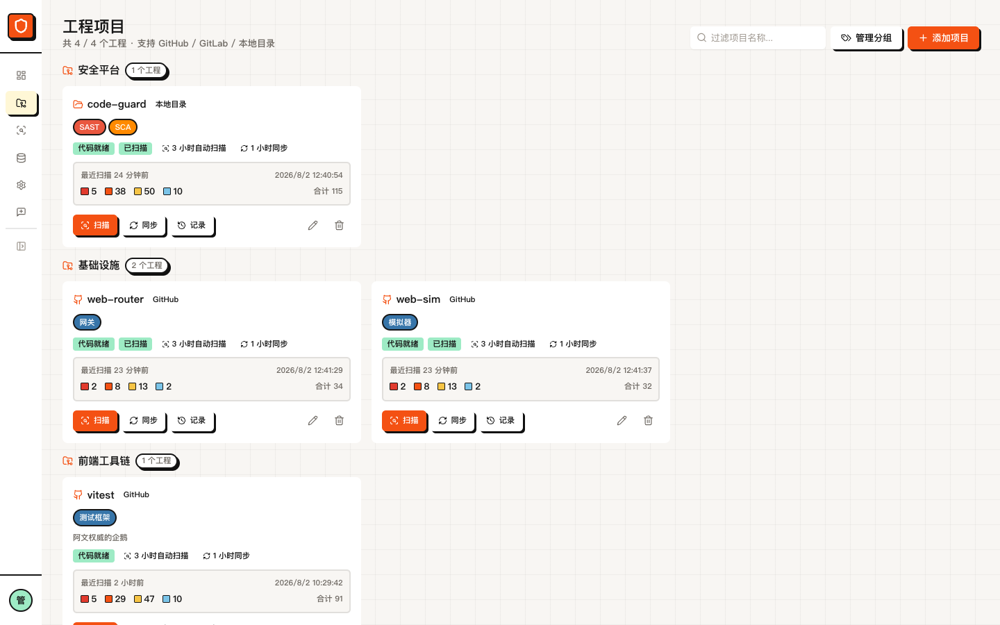
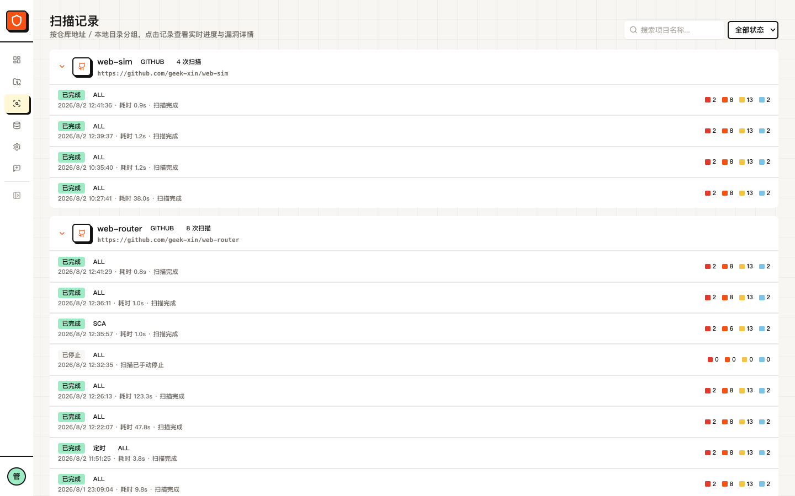
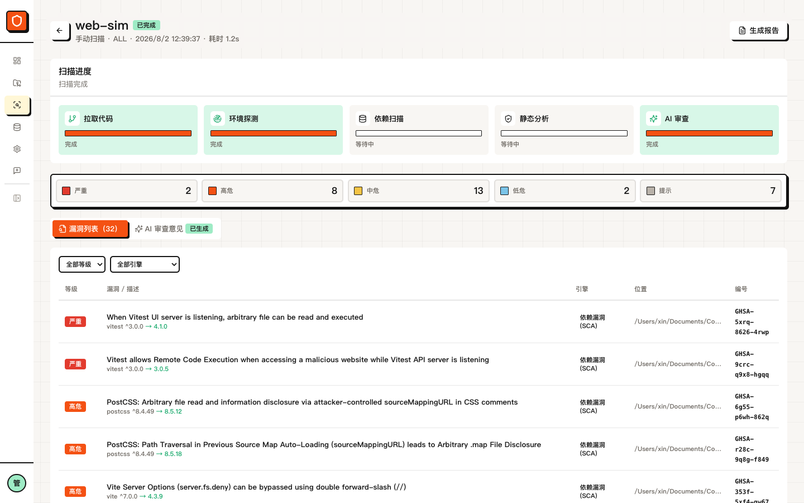
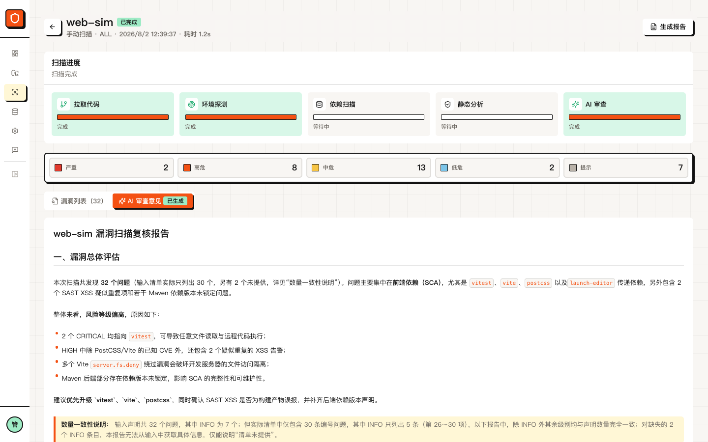
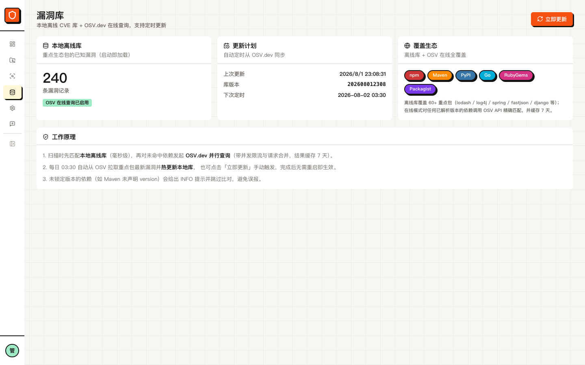
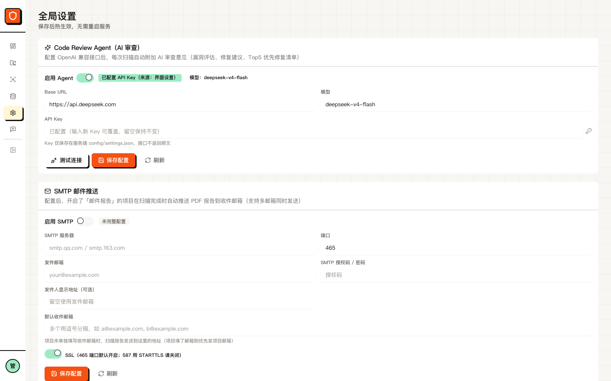

# CodeGuard 代码安全分析平台

<p align="center">
  
</p>

<p align="center">
  <a href="https://spring.io/projects/spring-boot"></a>
  
  
  
  
  
</p>

<p align="center">
  <a href="#功能总览">功能总览</a> ·
  <a href="#技术栈">技术栈</a> ·
  <a href="#界面截图">界面截图</a> ·
  <a href="#快速启动">快速启动</a> ·
  <a href="#配置说明">配置说明</a> ·
  <a href="#主要-api">主要 API</a> ·
  <a href="#文档入口">文档入口</a> ·
  <a href="#许可证">许可证</a>
</p>

`CodeGuard` 是一个面向团队的 **SAST + SCA + Code Review Agent** 代码安全分析平台：
支持 **GitHub / GitLab / 本地目录** 三种源码接入，自动拉取代码后并行执行
**静态代码分析（SAST）**、**依赖漏洞扫描（SCA，含 CVE 与修复版本）** 与 **AI 代码审查（可选）**，
实时推送扫描进度，按漏洞等级汇总并给出**解决方案**，可导出 **PDF / Word / Excel / HTML / Markdown / JSON** 扫描报告。

当前版本：`0.1.0`。

前端与后端架构参考 `web-sim`（Spring Boot WebFlux + React 19/Vite/Tailwind + Radix、卡片式 clay/chunky 视觉、本地 JSON 存储）。

## 功能总览

| 功能 | 说明 |
| --- | --- |
| 登录方式 | 本地账号注册/登录；**GitHub / GitLab OAuth**；支持「记住我」30 天免登录 |
| 项目接入 | GitHub 仓库 / GitLab 仓库（HTTPS/HTTP 克隆，支持远端分支选择拉取；私有仓库需 Token，GitLab 拉取分支必须携带 Token）/ 本地目录 |
| 实时扫描 | 一键扫描，SSE 推送每个阶段进度（拉取 → 探测 → SCA → SAST → Agent）与实时漏洞流 |
| 定时扫描 | 每个项目可配置 cron 表达式，调度器自动触发；也支持按分钟定时扫描 |
| 多工程并行 | 全局扫描线程池 + SAST 文件级并行 + OSV 并发限流与请求合并 |
| SCA 依赖扫描 | 解析 package.json / pom.xml / requirements.txt / go.mod / Gemfile / composer.json；离线漏洞库 + OSV.dev 在线精确匹配（缓存 7 天） |
| SAST 静态分析 | 30 条内置规则（SQL 注入、XSS、命令注入、反序列化、XXE、弱加密、硬编码密钥、SSRF、路径遍历、模板注入等），覆盖 8 种语言 |
| 漏洞库更新 | 每日 03:30 定时从 OSV 同步重点包漏洞并热更新；也可手动「立即更新」 |
| Code Review Agent | 可选配置 OpenAI 兼容接口，基于扫描结果生成修复方案与 Top 5 优先修复清单，流式展示思考过程 |
| 分组与标签 | 项目卡片支持分组管理与自定义标签，侧边栏可收起/展开 |
| 扫描报告 | 导出 **PDF / Word / Excel / HTML / Markdown / JSON** 六种格式 |
| 邮件推送 | 配置 SMTP 后，扫描完成自动推送 PDF 报告到指定邮箱 |
| GitHub Issue | 扫描结果 / 问题反馈可一键提交为平台仓库的 GitHub Issue |
| 安全设计 | 密码 PBKDF2 哈希存储、Token 不落前端、项目访问令牌不出现在 API 响应 |

## 技术栈

| 类型 | 技术 |
| --- | --- |
| 运行框架 | Spring Boot 3.5.2（WebFlux，Netty） |
| 代码拉取 | JGit |
| 漏洞数据 | 本地离线库（240 条种子）+ OSV.dev 在线查询 |
| PDF 生成 | OpenPDF（自动探测并嵌入系统中文字体） |
| Word/Excel | 手写 OOXML / SpreadsheetML（zip+XML，无第三方依赖） |
| 管理后台 | React 19 + Vite 7 + TypeScript |
| UI 风格 | Tailwind CSS + Radix UI + clay/chunky 卡片视觉（参考 web-sim） |
| 配置存储 | 本地 JSON 文件 |
| 构建工具 | Maven + npm |
| 许可证 | MIT |

## 架构概览



核心目录：

| 目录 | 说明 |
| --- | --- |
| `src/main/java/com/geek/codeguard/auth` | 登录、OAuth、Token |
| `src/main/java/com/geek/codeguard/project` | 项目管理与代码拉取 |
| `src/main/java/com/geek/codeguard/sca` | 依赖解析、漏洞库、OSV 客户端、漏洞库更新 |
| `src/main/java/com/geek/codeguard/sast` | 静态规则引擎（30 条规则 × 8 语言） |
| `src/main/java/com/geek/codeguard/agent` | Review Agent |
| `src/main/java/com/geek/codeguard/scan` | 扫描编排、SSE 进度、报告生成 |
| `src/main/resources/static/admin` | 已构建的前端管理台 |
| `config/` | 本地 JSON 数据目录（运行时生成，不纳入版本库） |
| `docs/` | 设计文档、实现计划与截图 |

## 界面截图

<p align="center">
  
  <br><em>登录页：本地账号 + GitHub / GitLab OAuth</em>
</p>

<p align="center">
  
  <br><em>安全总览：工程数 / 扫描次数 / 漏洞等级分布 / 近 14 天趋势</em>
</p>

<p align="center">
  
  <br><em>工程项目：分组 + 标签 + 卡片式管理</em>
</p>

<p align="center">
  
  <br><em>扫描记录：按工程分组，实时进度与漏洞汇总</em>
</p>

<p align="center">
  
  <br><em>扫描详情：漏洞列表按等级 / 引擎 / 类别筛选</em>
</p>

<p align="center">
  
  <br><em>AI 审查意见：漏洞总体评估与 Top 5 优先修复清单</em>
</p>

<p align="center">
  
  <br><em>漏洞库：离线库状态、覆盖生态与更新计划</em>
</p>

<p align="center">
  
  <br><em>全局设置：Review Agent 与 SMTP 邮件推送</em>
</p>

## 快速启动

要求：JDK 21+、Maven 3.9+、Node.js 20+。

```bash
# 1. 首次从源码构建前端管理台（产物输出到 src/main/resources/static/admin）
cd frontend
npm install
npm run build
cd ..

# 2. 启动后端（默认端口 9997，内置管理台）
mvn spring-boot:run
```

启动后访问：

- 管理后台：<http://localhost:9997/admin>
- 健康检查：<http://localhost:9997/api/health>

默认账号：`admin / admin123`（首次启动自动创建，请尽快修改）。

前端开发模式（热更新，`/api` 代理到后端 9997）：

```bash
cd frontend
npm run dev
```

## 打包编译

```bash
# 一键构建：前端 -> Maven 打包 -> 生成发布归档
scripts/build-dist.sh [--with-tests]

# 产物
target/codeguard-0.1.0.jar          # 可执行 Spring Boot jar
target/codeguard-0.1.0.tar.gz       # Linux/macOS 发布包
target/codeguard-0.1.0.zip          # Windows 发布包

# 运行发布包（Linux/macOS）
tar -xzf target/codeguard-0.1.0.tar.gz
cd codeguard-0.1.0
./run.sh        # 启动（日志在 logs/）
./stop.sh       # 停止

# Windows
# 解压 target/codeguard-0.1.0.zip 后执行 run.bat / stop.bat
```

## 配置说明

所有配置在 `src/main/resources/application.yml`（发布包中为 `config/application.yml`），支持环境变量覆盖：

| 配置 | 环境变量 | 默认值 |
| --- | --- | --- |
| 端口 | `SERVER_PORT` | `9997` |
| 数据目录 | `CODEGUARD_DATA_DIR` | `./config` |
| 工作区 | `CODEGUARD_WORKSPACE` | `./config/workspace` |
| Token 密钥 | `CODEGUARD_TOKEN_SECRET` | 开发默认值（生产必须覆盖） |
| GitHub OAuth | `GITHUB_CLIENT_ID/SECRET` | 空（未配置时 OAuth 按钮提示） |
| GitLab OAuth | `GITLAB_CLIENT_ID/SECRET/BASE_URL` | 空 |
| Review Agent | `CODEGUARD_AGENT_API_KEY/BASE_URL/MODEL` | 空（未配置自动跳过 Agent） |
| 扫描并发 | `CODEGUARD_SCAN_CONCURRENCY` | `4` |
| SAST 并行线程 | `CODEGUARD_SAST_THREADS` | `4` |
| OSV 并发 | `CODEGUARD_SCA_OSV_CONCURRENCY` | `6` |

### GitHub / GitLab OAuth 配置

1. GitHub：Settings → Developer settings → OAuth Apps → New OAuth App，回调地址填 `http://localhost:9997/api/auth/github/callback`，获取 Client ID / Secret。
2. GitLab：User Settings → Applications，回调地址填 `http://localhost:9997/api/auth/gitlab/callback`，勾选 `read_api` / `api` scope。
3. **推荐**：管理员在「设置 → 第三方登录」页面直接填写 Client ID / Secret / 回调地址，保存后热生效（写入 `config/settings.json`，优先于环境变量），登录页即支持 GitHub / GitLab 一键登录。
4. 或写入环境变量（`GITHUB_CLIENT_ID` / `GITHUB_CLIENT_SECRET` / `GITLAB_CLIENT_ID` / `GITLAB_CLIENT_SECRET` / `GITLAB_BASE_URL`）后重启。

### Review Agent 配置

设置 `CODEGUARD_AGENT_API_KEY`（OpenAI 兼容接口）后，扫描会自动附加 AI 审查意见
（漏洞总体评估、分类修复建议、Top 5 优先修复清单、误报分析）。可在「设置」页或
项目级开关中单独启用/关闭。

## 漏洞库

- 内置离线库：`config/vulndb/codeguard-vulndb.json`（240 条真实漏洞，覆盖 npm/Maven/PyPI/Go/RubyGems/Packagist 60+ 重点包）。
- 在线补充：OSV.dev 精确匹配任意依赖版本，结果缓存 7 天；未锁定版本（如 Maven 未声明 version）给出 INFO 提示并跳过比对避免误报。
- 定时更新：每日 03:30 自动同步重点包漏洞并热更新；管理台「漏洞库」页可手动立即更新。

## 主要 API

| 方法 | 路径 | 说明 |
| --- | --- | --- |
| POST | `/api/auth/login` / `/register` | 本地登录 / 注册（支持 `remember`） |
| GET | `/api/auth/github/authorize` | GitHub OAuth 跳转 |
| GET | `/api/auth/github/callback` | GitHub OAuth 回调 |
| POST | `/api/projects` | 添加项目（GITHUB/GITLAB/LOCAL） |
| POST | `/api/projects/{id}/sync` | 同步代码 |
| POST | `/api/scans` | 启动扫描（`scope=ALL/SCA/SAST/AGENT`） |
| GET | `/api/scans/{id}/events` | SSE 实时进度流 |
| GET | `/api/scans/{id}/findings` | 漏洞列表（按 severity/engine/category 筛选） |
| GET | `/api/scans/{id}/report?format=pdf` | 报告导出（html/pdf/word/excel/markdown/json） |
| GET | `/api/vulndb/status` | 漏洞库状态 |
| POST | `/api/vulndb/update` | 手动更新漏洞库 |
| GET | `/api/dashboard/stats` | 总览统计 |

## 说明与局限

- 本地 JSON 文件存储（参考 web-sim 设计），适合团队内网部署；如需多实例请自行接入数据库。
- SAST 为正则规则引擎，存在一定误报率；Review Agent 可辅助人工复核。
- Maven 依赖未声明版本时无法精确比对（详见「漏洞库」章节）。
- OAuth 与 Review Agent 均需自行申请密钥；未配置时对应功能自动降级。

## 开发与验证

```bash
# 后端测试 / 打包
mvn test
mvn package

# 前端验证
cd frontend
npm run typecheck
npm run build
cd ..

# 生成分发目录
./scripts/build-dist.sh
```

## 文档入口

- [设计说明](./docs/superpowers/specs/2026-08-02-codeguard-design.md)：需求背景、核心模型与架构设计。
- [实现计划](./docs/superpowers/plans/2026-08-02-codeguard-implementation.md)：分阶段实现任务记录。

## 许可证

本项目基于 [MIT](./LICENSE) 许可证开源，欢迎自由使用、修改与分发。
