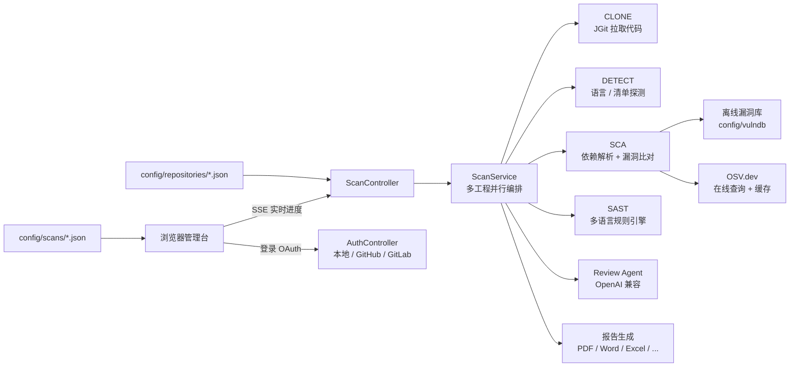
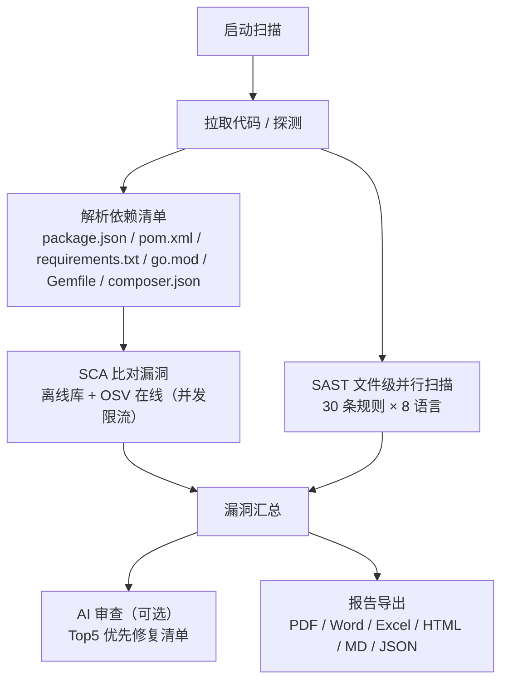

# CodeGuard 代码安全分析平台设计

日期：2026-08-02
状态：已实现并迭代至 0.1.0

## 1. 背景与目标

`CodeGuard` 是一个面向团队的 **SAST + SCA + Code Review Agent** 代码安全分析平台。它支持
GitHub / GitLab / 本地目录三种源码接入，自动拉取代码后并行执行静态代码分析（SAST）、
依赖漏洞扫描（SCA，含 CVE 与修复版本）与 AI 代码审查（可选），实时推送扫描进度，
按漏洞等级汇总并给出解决方案，可导出 PDF / Word / Excel / HTML / Markdown / JSON 六种格式报告。

前端与后端架构参考 `web-sim`（Spring Boot WebFlux + React 19/Vite/Tailwind + Radix、
卡片式 clay/chunky 视觉、本地 JSON 存储），目标是让中小团队在几分钟内获得内网可用的
安全扫描能力，不依赖外部 SaaS 平台。

## 2. 非目标

- 第一版不引入数据库、消息队列与服务注册中心，使用本地 JSON 文件存储（参考 web-sim）。
- SAST 使用正则规则引擎，存在一定误报率；不承诺媲美商业级语义分析精度。
- 不承诺对任意私有依赖做完整供应链溯源，仅对声明版本做精确比对。
- OAuth 与 Review Agent 均需自行申请密钥；未配置时对应功能自动降级。

## 3. 技术路线

- 后端：Spring Boot 3.5.2（WebFlux + Reactor Netty），JGit 拉取代码，OpenPDF 生成 PDF。
- 前端：React 19 + Vite 7 + TypeScript，Tailwind CSS + Radix UI，卡片式管理台。
- 漏洞数据：本地离线库（240 条重点包 CVE）+ OSV.dev 在线精确匹配（缓存 7 天）。
- 报告：PDF（OpenPDF，自动探测并嵌入系统中文字体）/ Word（手写 OOXML）/ Excel（手写 SpreadsheetML）。
- 存储：`config/` 目录本地 JSON 文件，运行时热生效。

## 4. 总体架构

## 5. 核心模型

### 5.1 工程（Project）

| 字段 | 说明 |
| --- | --- |
| `id` | UUID |
| `name` / `alias` | 仓库名与显示别名 |
| `source` | `GITHUB` / `GITLAB` / `LOCAL` |
| `repoUrl` / `branch` | 远程仓库与分支（JGit HTTPS 克隆） |
| `localPath` | 本地目录接入路径 |
| `group` / `tags` | 分组名称与标签 |
| `scheduleCron` | 定时扫描 cron 表达式 |
| `autoSyncEnabled` / `syncIntervalMinutes` | 定时同步 |
| `autoScanEnabled` / `scanIntervalMinutes` | 定时扫描 |
| `agentReviewEnabled` | 项目级 AI 审查开关（默认关闭） |
| `emailNotify` / `emails` | 扫描完成邮件推送 |

### 5.2 扫描记录（ScanRecord）

| 字段 | 说明 |
| --- | --- |
| `id` | UUID |
| `projectId` / `projectName` | 所属工程 |
| `scope` | `ALL` / `SCA` / `SAST` / `AGENT` |
| `status` | `RUNNING` / `COMPLETED` / `FAILED` / `STOPPED` |
| `stages` | 各阶段进度：`{stage: {status, current, total, message}}` |
| `summary` | 等级统计与引擎/类别分布 |
| `findings` | 漏洞明细（单独 findings 文件） |
| `agentReview` | AI 审查 Markdown 报告 |

### 5.3 漏洞（ScanFinding）

- 来源引擎：`SCA` / `SAST` / `AGENT`。
- 等级：`CRITICAL` / `HIGH` / `MEDIUM` / `LOW` / `INFO`。
- 字段：`ruleId`、`category`、`message`、`file`、`line`、`snippet`、`remediation`、`cveId`、`affectedRange`、`fixedVersion` 等。
- SAST 类别：sql-injection、command-injection、xss、weak-crypto、xxe、deserialization、
  hardcoded-secret、path-traversal、ssrf、code-execution、regex-dos、weak-random、
  insecure-tls、open-redirect、ssti、prototype-pollution。

### 5.4 SAST 规则（SastRule）

- 内置 `src/main/resources/sast-rules.json`：**30 条规则、16 类漏洞、8 种语言**
  （python 11 / java 10 / javascript 10 / typescript 10 / php 5 / go 4 / ruby 1 / csharp 1）。
- 支持从 `config/rules/sast-rules.json` 外部扩展覆盖（启动时优先加载外部文件）。
- 规则字段：`id`、`category`、`severity`、`languages`、`patterns`（正则）、`message`、`remediation`。

### 5.5 漏洞库（VulnerabilityDb）

- 离线库：`config/vulndb/codeguard-vulndb.json`（240 条真实 CVE，覆盖 npm/Maven/PyPI/Go/RubyGems/Packagist）。
- 在线：OSV.dev 精确匹配（`ecosystem + name + version`），结果内存 + 磁盘缓存 7 天。
- 更新：每日 03:30 定时同步 + 管理台手动「立即更新」，热更新不重启。

## 6. 扫描流水线

- 全局扫描线程池（`scan-concurrency: 4`）+ SAST 文件级并行（`sast-threads: 4`）。
- OSV 并发限流与请求合并（`sca-osv-concurrency: 6`），避免限流与重复查询。
- SSE 实时推送阶段进度与漏洞流；停止扫描会中断后端 SAST（文件级取消检查）与 Agent 流式读取。
- 未锁定版本（如 Maven 未声明 version）给出 INFO 提示并跳过比对，避免误报。

## 7. 安全设计

- 密码 PBKDF2 哈希存储；Token 使用服务端密钥签名，不落前端（localStorage 仅存 token 本身）。
- 项目访问令牌（GitHub/GitLab token）不参与 JSON 序列化，接口响应不含明文。
- API Key（Review Agent）仅保存在服务端 `config/settings.json`，接口不返回明文。
- 默认账号 `admin / admin123`（首次启动自动创建，README 提示尽快修改）。

## 8. 界面与交互

- 登录：本地账号 + GitHub / GitLab OAuth + 「记住我」30 天。
- 总览：工程数 / 扫描次数 / 漏洞总数与等级分布 / 近 14 天趋势图 / 引擎分布 / 最近扫描。
- 项目：分组管理 + 标签 + 卡片式展示 + 扫描记录入口 + 一键同步。
- 扫描记录：按工程分组，实时进度、漏洞筛选、AI 审查意见、生成报告、一键提交 GitHub Issue。
- 漏洞库：离线库状态、覆盖生态、更新计划、手动更新。
- 设置：Review Agent（OpenAI 兼容）、SMTP 邮件推送、OAuth 配置。

## 9. 部署与配置

- 一键构建：`scripts/build-dist.sh [--with-tests]`（前端 → Maven 打包 → tar.gz/zip 分发）。
- 环境变量：`SERVER_PORT`（9997）、`CODEGUARD_DATA_DIR`、`CODEGUARD_WORKSPACE`、
  `CODEGUARD_TOKEN_SECRET`、`GITHUB_CLIENT_ID/SECRET`、`GITLAB_CLIENT_ID/SECRET/BASE_URL`、
  `CODEGUARD_AGENT_API_KEY/BASE_URL/MODEL`、`CODEGUARD_SCAN_CONCURRENCY` 等。

## 10. 里程碑

| 里程碑 | 内容 | 状态 |
| --- | --- | --- |
| M1 | 脚手架、本地登录、GitHub/GitLab 接入、JGit 拉取 | 已完成 |
| M2 | SAST 规则引擎 + 多语言规则库 | 已完成 |
| M3 | SCA 依赖解析 + 离线库 + OSV 在线查询 | 已完成 |
| M4 | 扫描编排、SSE 进度、停止扫描、定时扫描 | 已完成 |
| M5 | Review Agent（流式思考 + Markdown 报告） | 已完成 |
| M6 | 报告导出 PDF/Word/Excel/HTML/MD/JSON | 已完成 |
| M7 | 分组/标签、SMTP 邮件、GitHub Issue、漏洞库更新 | 已完成 |
| M8 | README 与文档整理、MIT 许可证 | 已完成（0.1.0） |
